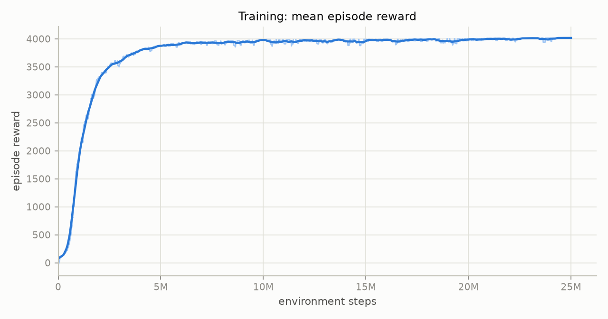
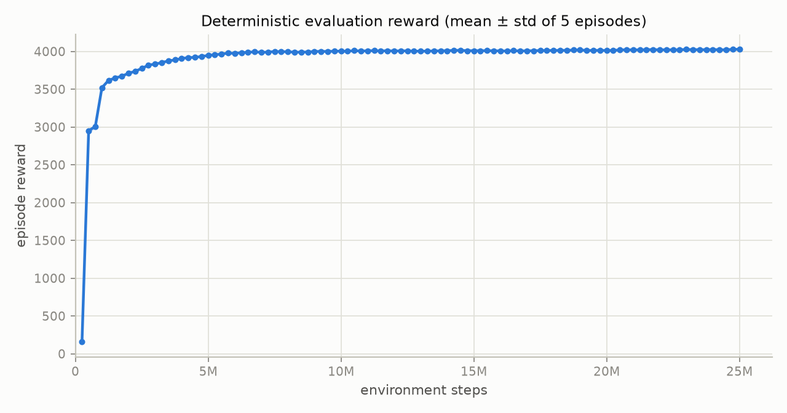
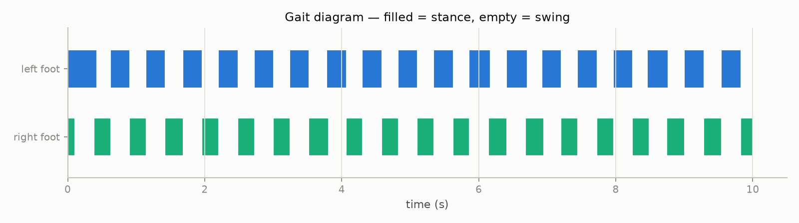
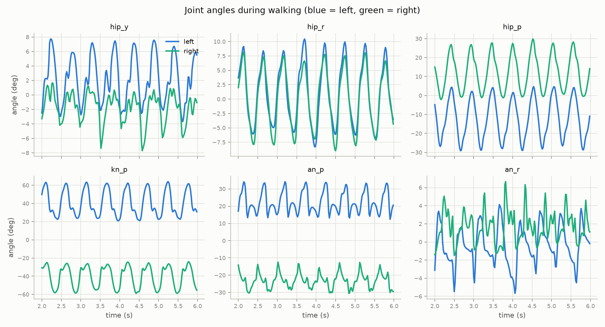
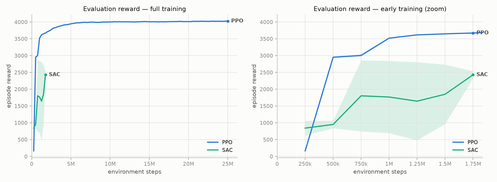
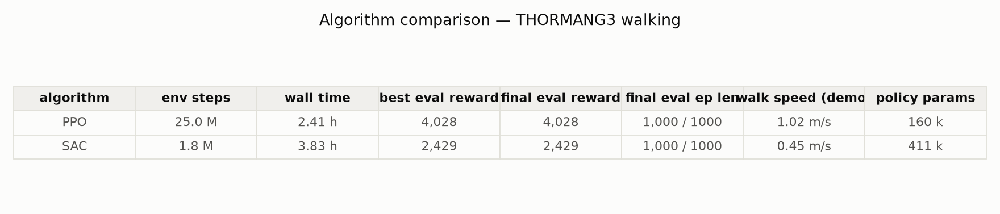

# Learning Bipedal Locomotion for THORMANG3 with Deep RL
> By Salar Mokhttari Laleh


A complete reinforcement-learning pipeline that teaches the
[ROBOTIS THORMANG3](https://emanual.robotis.com/docs/en/platform/thormang3/thormang3_ros_packages/)
full-size humanoid (1.37 m, ~44 kg, 29 DOF) to walk in MuJoCo. Two deep-RL
algorithms — on-policy **PPO** and off-policy **SAC** — are trained on the
same task and compared on sample efficiency, wall-clock time and final gait
quality. Policies are trained against **random push perturbations**,
**dynamics randomization** (mass, friction) and **sensor noise**. Demo
videos include a **real-time map** (trajectory, footsteps, applied pushes)
with live speed and gait telemetry.

---

## 🎬 Demo

> Click any video below — GitHub plays `.mp4` files directly in the browser.

| | |
|---|---|
| ▶️ **[PPO walking demo](runs/ppo/videos/demo.mp4)** | trained PPO policy walking under random pushes — 3D view + HUD + live map / speed / gait dashboard (24 s) |
| ▶️ **[SAC walking demo](runs/sac/videos/demo.mp4)** | the same demo for the trained SAC policy (24 s) |
| ▶️ **[PPO vs SAC race](runs/ppo/videos/race.mp4)** | both policies side by side on the same seed, with live speed / distance / falls HUDs (20 s) |
| ▶️ **[Early-training gait (2M steps)](runs/walk/videos/demo_2M_steps.mp4)** | what the gait looked like early in training, for comparison |

To regenerate the demos from a trained run:

```bash
python record_video.py --run runs/ppo --seconds 24
python race_video.py --left runs/ppo --right runs/sac --seconds 20
```

---

## 1. How to run the project

```bash
# 0) environment (once)
conda activate MuJoCo
pip install -r requirements.txt
cd thormang3_walk

# 1) build the MuJoCo model from the official ROBOTIS URDF (once)
python convert_model.py --png build/stand.png        # must print [stand] PASS

# 2) train on the GPU  (PPO ≈ 1.5-2 h, SAC ≈ 2.5 h on a 16-core RTX 2080 SUPER)
python train.py --algo ppo --run runs/ppo --timesteps 25000000 --n-envs 12 --device cuda
python train.py --algo sac --run runs/sac --timesteps 3500000  --n-envs 6  --device cuda --ckpt-freq 500000

#    watch it live:
tensorboard --logdir runs                            # http://localhost:6006

# 3) demo videos (with the real-time map dashboard)
python record_video.py --run runs/ppo --seconds 24
python record_video.py --run runs/sac --seconds 24
python race_video.py --left runs/ppo --right runs/sac --seconds 20

# 4) figures & algorithm comparison
python make_plots.py --run runs/ppo
python make_plots.py --run runs/sac
python compare.py --runs runs/ppo runs/sac --labels PPO SAC

# 5) real-time interactive demo (needs a display)
python live_demo.py --run runs/ppo --map
```

Every run directory is self-contained:
`runs/<name>/{checkpoints, best, eval, logs, monitor, videos, plots}`.
Ctrl-C during training is safe (`final_model.zip` is written); continue with
`--resume`. Videos render headless via EGL automatically.

## 2. Videos

| file | content |
|---|---|
| [`runs/ppo/videos/demo.mp4`](runs/ppo/videos/demo.mp4) | PPO walking, 3D view + HUD + **live map / speed / gait panel**, pushes marked with a red **PUSH** badge and a force arrow on the map |
| [`runs/sac/videos/demo.mp4`](runs/sac/videos/demo.mp4) | the same for SAC |
| [`runs/ppo/videos/race.mp4`](runs/ppo/videos/race.mp4) | **PPO vs SAC side by side**, same seed, live speed/distance/falls HUDs |
| [`runs/walk/videos/demo_2M_steps.mp4`](runs/walk/videos/demo_2M_steps.mp4) | early-training gait (first pipeline version, 2M steps) |

The dashboard panel is drawn live every frame: top-down **map** with the
pelvis trajectory, left/right footstep touchdown positions and the current
push-force vector; **forward-speed trace** against the target; **gait
diagram** (stance/swing bands per foot).

## 3. Plots

Generated per run into `runs/<run>/plots/` (14 figures) and
`runs/comparison/` (4 figures + `comparison.md`):

| training | rollout analysis | comparison |
|---|---|---|
| 01 reward curve | 07 forward speed vs target | cmp_01 eval reward vs steps (+ zoom) |
| 02 episode length | 08 pelvis height & uprightness | cmp_02 eval reward vs wall-clock |
| 03 eval reward ± std | 09 gait diagram | cmp_03 speed & episode length |
| 04 optimizer diagnostics | 10 joint angles L vs R | cmp_04 summary table |
| 05 all 13 reward components | 11 RMS torque per joint | |
| 06 speed & distance | 12 action heatmap, 13 top-down trajectory, 14 rollout reward components | |

Selected results (regenerate with the commands above):








## 4. Task formulation

### Observation (48-D)

$$
o_t=\bigl[\,z_t,\;\hat{g}_t,\;{}^{B}v_t,\;{}^{B}\omega_t,\;q_t-q_{0},\;\dot{q}_t,\;a_{t-1},\;c_t\,\bigr]\in\mathbb{R}^{48}
$$

with pelvis height $z_t$, gravity direction $\hat g_t\in\mathbb R^3$ and base
linear/angular velocities ${}^{B}v_t,{}^{B}\omega_t$ expressed in the base
frame (no absolute yaw — the policy is heading-invariant), the 12 leg joint
angles relative to the standing pose $q_0$, joint velocities, previous
action and binary foot contacts $c_t\in\{0,1\}^2$. Gaussian sensor noise is
added to all proprioceptive entries.

### Action → PD position control (50 Hz)

$$
q^{des}_t=\mathrm{clip}\!\bigl(q_0+0.4\,a_t,\;q_{min},\;q_{max}\bigr),\qquad
u_t=\alpha\,q^{des}_t+(1-\alpha)\,u_{t-1},\quad \alpha=0.6
$$

$$
\tau_t=\mathrm{clip}\!\bigl(k_p\,(u_t-q_t)-d\,\dot q_t,\;-\tau_{max},\;\tau_{max}\bigr),
\qquad k_p=400,\; \tau_{max}=44\ \mathrm{N\,m}
$$

### Reward (13 terms)

$$
r_t=
\underbrace{w_v\,\tfrac{\min(v^{fwd}_t,\,1.25\,\bar v)}{\bar v}}_{\text{forward}}
+\underbrace{w_a}_{\text{alive}}
+\underbrace{w_u\,\mathrm{clip}\bigl(\tfrac{u_z-0.7}{0.3},0,1\bigr)}_{\text{upright}}
+\underbrace{w_h\,\mathrm{clip}\bigl(\tfrac{z_t-z_{min}}{z_0-z_{min}},0,1\bigr)}_{\text{height}}
+\underbrace{w_{ss}\,\mathbb{1}\bigl[\textstyle\sum_f c^f_t=1 \wedge v^{fwd}_t>0.2\bigr]}_{\text{single support}}
$$

$$
+\underbrace{w_{air}\sum_{f\in TD_t}\bigl(\mathrm{clip}(T^{air}_f,0,0.5)-0.25\bigr)}_{\text{swing air time}}
-\;w_{c}\|a_t\|^2
-\;w_{\dot a}\|a_t-a_{t-1}\|^2
-\;w_{\tau}\|\tau_t\|^2
-\;w_{sl}\!\!\sum_{f:\,c^f_t=1}\!\!\|v^{xy}_{f,t}\|
-\;w_{lat}\,v_{y,t}^2
-\;w_{yaw}\,\omega_{z,t}^2
-\;w_{\dot q}\|\dot q_t\|^2
$$

where $v^{fwd}_t$ is the heading-projected base velocity, $\bar v=0.8$ m/s
the target speed, $TD_t$ the set of feet touching down at step $t$ and
$T^{air}_f$ the preceding swing duration.

| $w_v$ | $w_a$ | $w_u$ | $w_h$ | $w_{ss}$ | $w_{air}$ | $w_c$ | $w_{\dot a}$ | $w_\tau$ | $w_{sl}$ | $w_{lat}$ | $w_{yaw}$ | $w_{\dot q}$ |
|---|---|---|---|---|---|---|---|---|---|---|---|---|
| 2.0 | 1.0 | 0.4 | 0.4 | 0.15 | 1.0 | 0.02 | 0.05 | 1e-5 | 0.1 | 0.25 | 0.15 | 2e-4 |

### Episode termination

$$
z_t<0.55\ \lor\ z_t>1.05\ \lor\ u_z<0.5
\qquad\text{(else truncated at } T=1000 \text{ steps}=20\,\mathrm{s})
$$

### Domain randomization (per episode / event)

$$
F_{push}\sim\mathcal U(20,70)\,\mathrm{N},\ \ 0.15\,\mathrm{s},\ \ \text{every } \mathcal U(3,6)\,\mathrm{s};\qquad
m\!\leftarrow\! m\,\mathcal U(0.9,1.1);\qquad
\mu\!\leftarrow\!\mu\,\mathcal U(0.7,1.3)
$$

## 5. Algorithms

**PPO** maximizes the clipped surrogate with GAE advantages
$\hat A_t=\sum_{l}(\gamma\lambda)^{l}\,\delta_{t+l}$:

$$
L^{CLIP}(\theta)=\mathbb E_t\Bigl[\min\bigl(\rho_t(\theta)\hat A_t,\;
\mathrm{clip}(\rho_t(\theta),1-\epsilon,1+\epsilon)\hat A_t\bigr)\Bigr],
\qquad \rho_t(\theta)=\tfrac{\pi_\theta(a_t\mid s_t)}{\pi_{\theta_{old}}(a_t\mid s_t)}
$$

**SAC** maximizes entropy-regularized return with twin critics and
automatically tuned temperature $\alpha$:

$$
J(\pi)=\sum_t\mathbb E\bigl[r_t+\alpha\,\mathcal H(\pi(\cdot\mid s_t))\bigr],
\qquad
y_t=r_t+\gamma\Bigl(\min_{i=1,2}\bar Q_i(s_{t+1},a')-\alpha\log\pi(a'\mid s_{t+1})\Bigr)
$$

| | PPO (on-policy) | SAC (off-policy) |
|---|---|---|
| networks | $\pi$: 256×256, $V$: 256×256 (tanh) | $\pi$: 256×256, twin $Q$: 256×256 |
| key params | $n_{steps}$ 1024×n_envs, 4 minibatches, 10 epochs, $\epsilon$=0.2, $\lambda$=0.95, lr 3e-4→3e-5 | replay 1M, batch 512, $\tau$=0.005, UTD≈1, auto $\alpha$ |
| normalization | VecNormalize obs + reward | VecNormalize obs only |
| $\gamma$ | 0.99 | 0.99 |

## 6. Model conversion notes

The official description ships broken for physics; `convert_model.py` fixes
and verifies everything (stand-hold test, CoM centring, flat-foot check):

| issue in official files | fix |
|---|---|
| real inertias commented out (identity placeholders active) | restored from the comments |
| `chest_link` inertia not positive definite (`ixz` = `ixx` typo) | off-diagonals dropped |
| gripper links with zero inertia diagonals | clamped to 1e-5 |
| 29 actuated DOFs (arms/head/grippers irrelevant for walking) | 21 joints welded at a natural pose (FK-searched), 12 leg DOFs remain |

Simulation: MuJoCo 3, $\Delta t=2.5$ ms, `implicitfast` integrator, box feet
↔ floor and leg ↔ leg collisions only, frame skip 8 (50 Hz control).
